# Replacement Firmware for the Aeris Aair 3-in-1 Pro Air Purifier

This guide will walk you through flashing a new firmware onto the Aeris Aair 3-in-1 Pro Air Purifier, which will enable local control of the device over MQTT, which can then be added and controlled via Home Assistant. It also allows some small customization of the appearance of the top display.

<table>
  <tr>
    <td valign="middle">
      
    </td>
    <td valign="middle">
      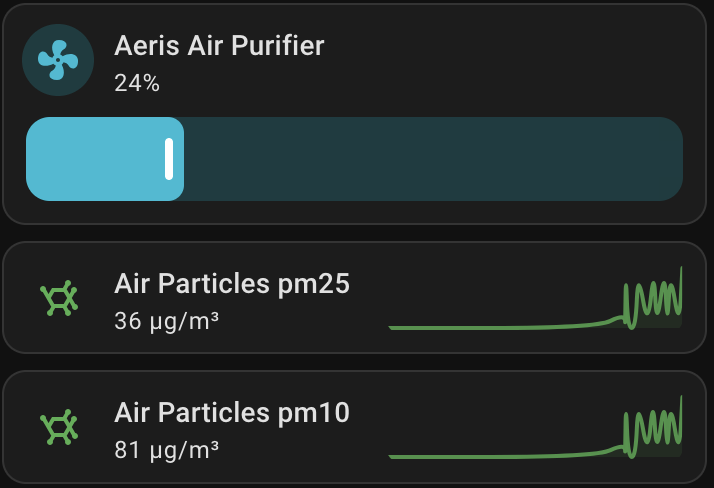
    </td>
  </tr>
</table>

<br>
<br>

## Disclaimer

It is not currently possible to re-flash the original vendor-provided firmware. This is a one-way process. It may be possible in the future to re-flash but I'm not aware how to do it. Please go into this with the understanding that there is no way back. The steps below are not complicated to do but make sure you read through everything before committing. In terms of feature loss, there is no built in logic to adjust fan speed based on air quality. Since the device can be controlled over MQTT now that logic can be done via Home Assistant. I have included an example automation you can add to Home Assistant to do just this.

<br>
<br>

## Software Needed:

The guide below and the software linked to here are for flashing from Windows. If you are using Mac or Linux the software is definitely there, but you'll need to locate the appropriate versions yourself.

1.  [Zadig](<https://zadig.akeo.ie/>)

2.  [dfu-util v0.9](<http://dfu-util.sourceforge.net/releases/dfu-util-0.9-win64.zip>)

3.  [Particle CLI](<https://binaries.particle.io/cli/installer/windows/ParticleCLISetup.exe>)

4.  [Free Particle CLI Account](<https://login.particle.io/signup>)

5.  [Particle Bootloader update](<https://github.com/particle-iot/device-os/releases/download/v3.3.0/photon-bootloader%403.3.0%2Blto.bin>)

6.  [Replacement Software Binary](https://github.com/mjaymeyer/aeris-aair-home-assistant/releases) (unless building from source)

<br>
<br>

## Teardown/Accessing Board

1.  Unplug unit, remove top cover and flip over


3.  Remove the eight short screws, carefully lift out the inner-part of
    the case bottom to top to not damage the wires upper-left

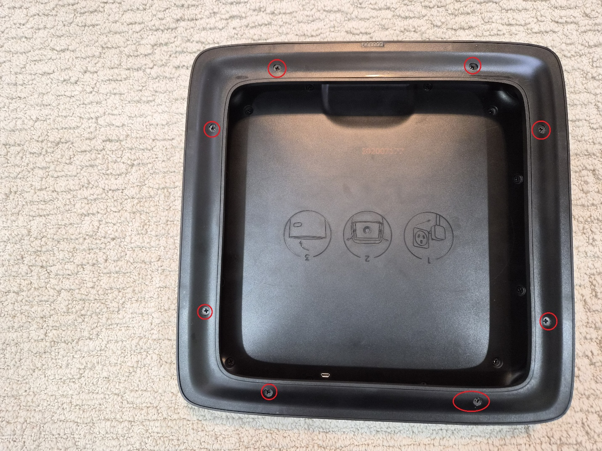

3.  Remove the four silver screws, again carefully lift the outer
    bracket bottom to top to not damage the wires


4.  Remove the 12 slightly longer screws. Carefully pull the plastic
    cover bottom to top to reveal the main board.


5.  Carefully pull off the wire connector to separate the main board
    from the body entirely. No need to unscrew the board from the white
    plastic backing.


6.  For the flashing process we will use the two buttons 'RESET' and
    'SETUP' that should be pretty easy to work with.


## Flashing Replacement Software

The below shows the steps to flash from a Windows machine. If you're
using Mac or Linux it shouldn't be too hard to obtain the relevant
versions and follow along.

### Initial Connection, Driver Install

1.  Extract dfu-util to a folder. I've used C:\\DFU (no subfolders, you
    should be able to execute C:\\DFU\\dfu-util.exe)

2.  Attach the micro-usb cable to the unit, two LEDs should come on


3.  Put the device in DFU mode by pressing both the RESET
    and SETUP buttons. Immediately let go of RESET but continue holding
    SETUP for 3 seconds. LED59 (to the right of the
    setup button) should start flashing yellow, you are in DFU mode and
    you can let go of the SETUP button.

4.  Launch Zadig


5.  Go to Options and check 'List All Devices'


6.  Select Photon DFU Mode in the dropdown (if you do not see it try
    unplugging the micro-usb cable, waiting a few, then plugging it back
    in and putting the device back in DFU mode again).

7.  Note the USB ID listed (2B04:D006). We will reference this in later
    steps so take note if yours is different and adjust accordingly.


8.  Select libusbK (v3.1.0.0) on the right using the down arrows (note
    that I already installed the driver on my device so it matches the
    driver listed on the left, yours likely will not). Click 'Replace
    Driver' and wait for it to install. Once installed you can close
    Zadig.

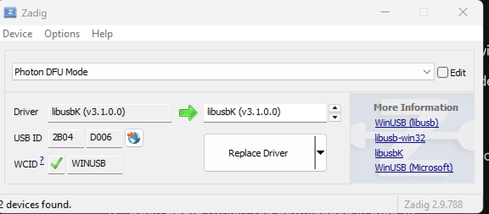

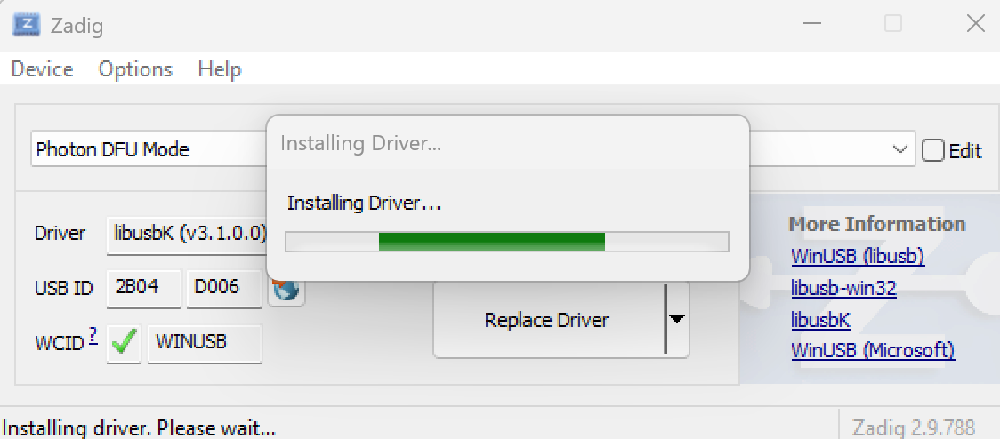

### Taking a Backup

First we'll make a backup of the original software.

NOTE: Although we're making a backup I was unable to re-flash it to my
device. I'm only backing up the original software in case someone
smarter than myself can figure out how to re-flash it should someone
choose to. Please proceed only if you're okay with potentially never
going back to the original manufacturer software.

1.  Open an admin-level command prompt and navigate to the folder you
    extracted dfu-utils to.


2.  Execute the following command to backup the firmware, adjusting the
    device ID if necessary.

```dfu-util.exe -d 2b04:d006 -a 0 -s 0x08020000:0xE0000 -U original_firmware.bin```
>


3.  This should export original_firmware.bin (despite it saying Upload)
    to the same directory you put dfu-util in. Backup the .bin to a safe
    place.

### Updating the Bootloader and Base Particle System

You will likely need to update the bootloader of the device to flash the
new software to it. It's possible there are some units out there with a
later bootloader but given the software support of Aeris, I doubt it. I
don't recall ever receiving a firmware update on my device from the
manufacturer.

#### Updating Bootloader

1.  Download the bootloader if you have not already, rename it
    to bootloader.bin to make it easier. I placed it in the same DFU
    folder to keep things simple.

2.  Install Particle CLI if you have not already. Test that you can
    execute it from command prompt (you may have to open a new Window if
    you just installed it)

```particle version```
>
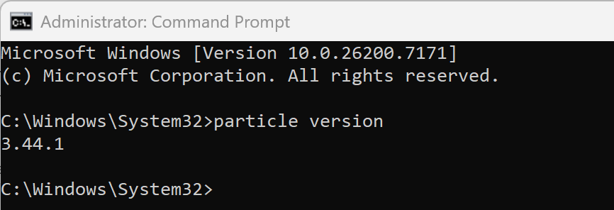

3.  Run the below command to flash the bootloader

```particle flash --local C:\DFU\bootloader.bin```
>
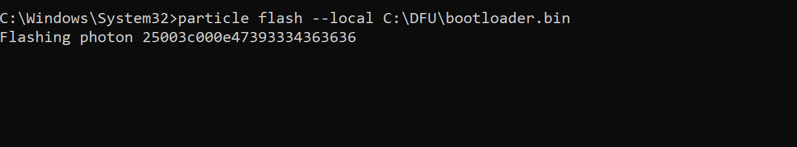


#### Updating the Particle software

1.  To get the latest system version from particle we need to login.
    Enter the below command followed by your email and password you
    setup when you created an account on particle.io

```particle login```

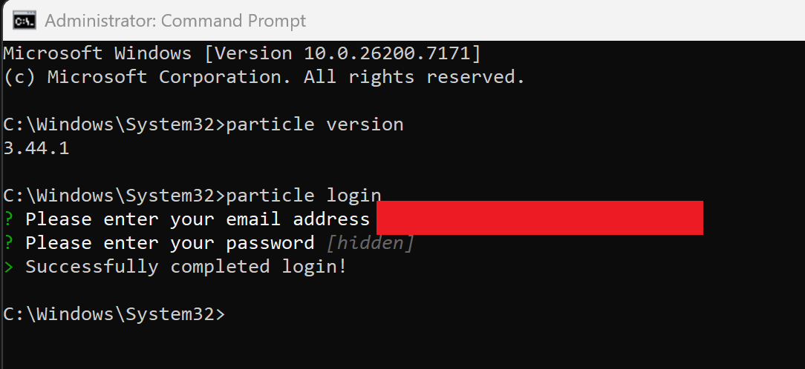

2.  To update the bootloader and base system simply enter the below.

```particle update```

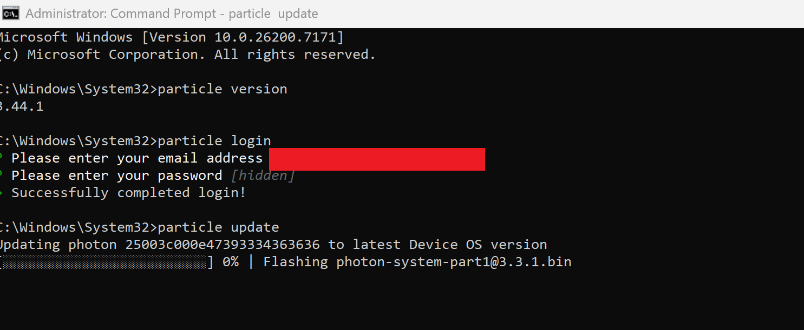

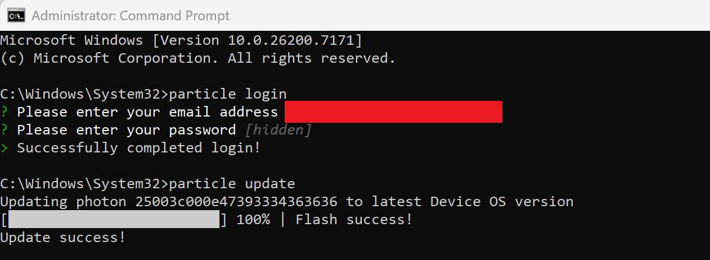

NOTE: Your device may seem to freeze (like below) when it gets to "Switching device to normal mode", if it says it fails after this do not panic, it is likely fine. You likely don't need to update again but are welcome to put your device back in DFU mode and try it again if you'd like, though I don't believe anything else needs updated. My device would seemingly fail after the switch back to normal mode but the software was definitely good to go regardless.


## Flashing the compiled binary

1.  Download the Release aerisFirmware.bin if you have not
    already, I placed it in the same folder as I put dfu-util. Put your
    device back into DFU mode if it is not.

2.  In CMD make sure you are back in the same folder where you have
    dfu-util.

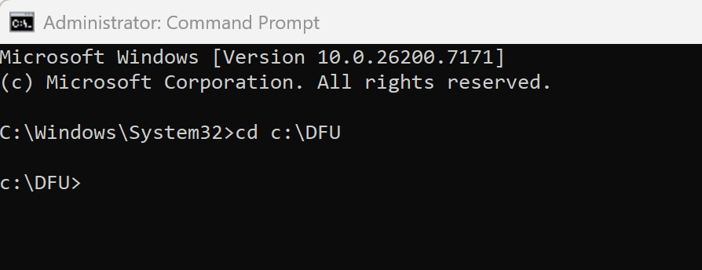

3.  Simply run the below command to flash the new software, it should
    install very quickly.

```dfu-util.exe -d 2b04:d006 -a 0 -s 0x080A0000:leave -D aerisFirmware.bin```
>
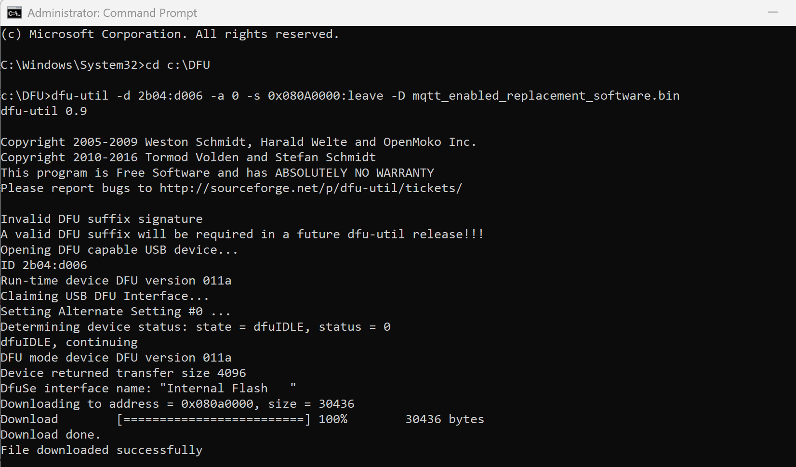

4.  Assuming it flashed if you look on the front panel you should see
    the following setup screen


At this point you can unplug the USB and put back together your air
purifier, though you can run through the below first if you'd like.

## Setup Process

It is highly recommended to set the device up from a laptop as it is
much easier than fighting with a phone.

### Stage One (WiFi Network Connecting)

1.  An unencrypted WiFi network named Aeris-xxxx should be broadcasting.
    Connect to it and in a web browser navigate to <http://192.168.0.1>

2.  Enter your WiFi network credentials and click CONNECT, the device
    should restart.

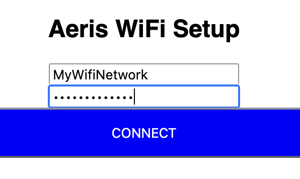

3.  Assuming you entered valid credentials you should see the unit
    display OFF and the buttons should function.


### Stage Two (MQTT and Display Customization)

1.  In a web browser now navigate to the true IP of the air purifier on
    your network (such as http://192.168.0.32). If it doesn't load confirm that you are hitting the right device and that you are not using https://, you should get the below page.

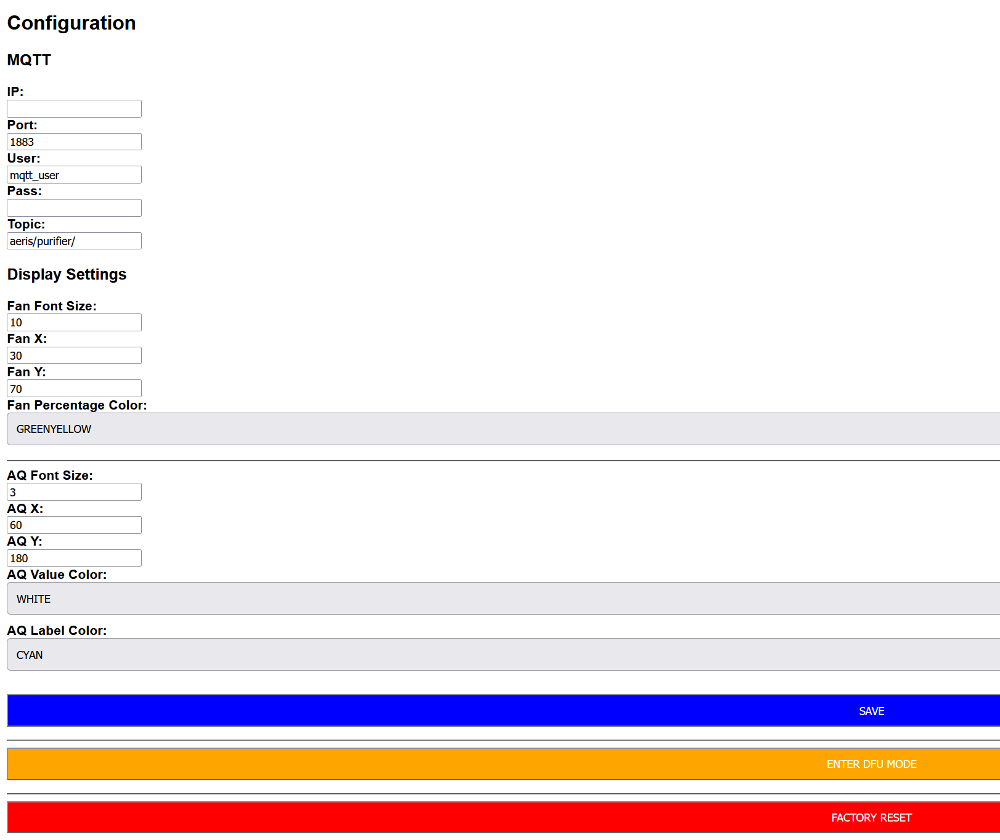

2.  The display settings are already configured though you can of course
    adjust them to achieve a different look. In the top MQTT section
    enter your MQTT broker IP (e.g., 192.168.0.100), the port if
    different, and your username and password. You can change the
    broadcast MQTT topic prefix if you like (such as if you have
    multiple Aeris Purifiers and you need them unique).

3.  Hit save and the unit will reboot once more and you should see
    any display changes if you made them.

4.  Note that you can enter your purifier back into DFU Mode over this interface. This way you can flash a new firmware to it without having to unscrew the top to get to the board again.

### Home Assistant

#### Defining Sensors and Fan

1.  In your configuration.yaml add the following (adjust the prefix if
    you changed that in Stage Two) and reboot your Home Assistant.

```
mqtt:
  sensor:
    - name: "Aeris PM2.5"
      state_topic: "aeris/purifier/sensor/pm25"
      unit_of_measurement: "µg/m³"
      device_class: pm25
      state_class: measurement
    - name: "Aeris PM10"
      state_topic: "aeris/purifier/sensor/pm10"
      unit_of_measurement: "µg/m³"
      device_class: pm10
      state_class: measurement
  fan:
    - name: "Aeris Air Purifier"
      state_topic: "aeris/purifier/fan/state"
      command_topic: "aeris/purifier/fan/set"
      percentage_state_topic: "aeris/purifier/fan/state"
      percentage_command_topic: "aeris/purifier/fan/set"
      speed_range_min: 1
      speed_range_max: 255
      payload_on: "30"
      payload_off: "0"
      optimistic: false
      state_value_template: >
        
          0
        
          30
        
```

#### Automation Yaml:

Here's a basic yaml confiugration that only executes if you haven't switched the purifier off. 
It keeps a minimum fan speed of 10% up to a PM2.5 reading of 40. Above that it will take the reading *0.25 for the fan speed.

```
alias: Air Purifier Smart Control
description: 
triggers:
  - trigger: state
    entity_id: sensor.aeris_purifier_pm25
conditions:
    # Will not automatically turn on if in an off state
  - condition: state
    entity_id: fan.aeris_purifier
    state: "on"
actions:
  - action: fan.set_percentage
    target:
      entity_id: fan.aeris_purifier
    data:
      percentage: >
        
        {# If the PM2.5 reading is 40 or under run at 10% (this is the minimum percentage the purifier will run at) #}
        
          10 
        
          {# Otherwise set the fan speed to the PM2.5 reading * 0.25 up until a maximum of 100% #}
          {{ ([pm * 0.25, 100] | min) | int }}
        
mode: restart
```

## Alternative - Creating From Source Code

If you don't want to flash a new .bin you can't see the source code of
then you can build from source here. This part of the guide assumes you
have at least run through the driver install, backup, updating
bootloader, and updating the particle software sections.

1.  In the root of your hard drive create a folder 'aeris_project'

2.  Download project.properties to the root

3.  Create a sub-folder 'src'

4.  Download purifier.ino to /src/

5.  In command prompt, navigate to the aeris_project folder

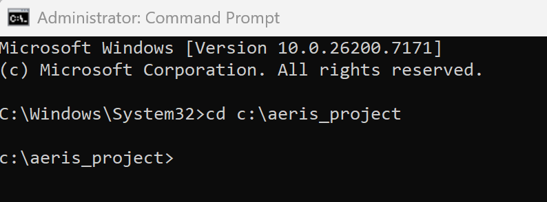

6.  Run the below command to compile the .ino code into a binary

```particle compile photon . --saveTo aerisFirmware.bin```


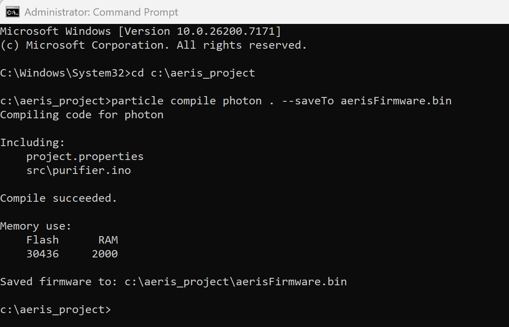

7.  Flash the firmware to your device with:

    ```dfu-util.exe -d 2b04:d006 -a 0 -s 0x080A0000:leave -D aerisFirmware.bin```
